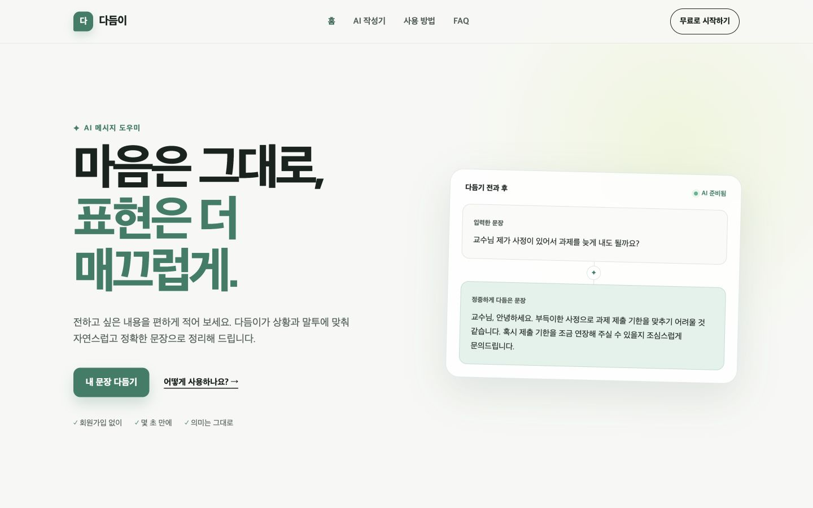
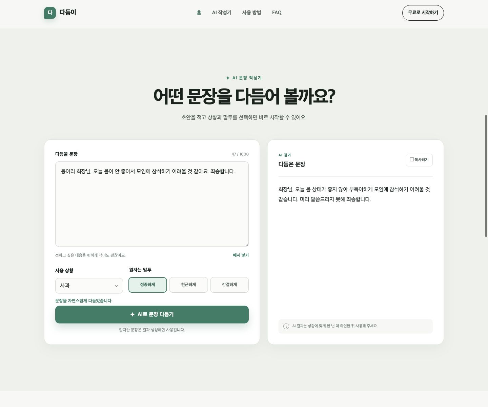
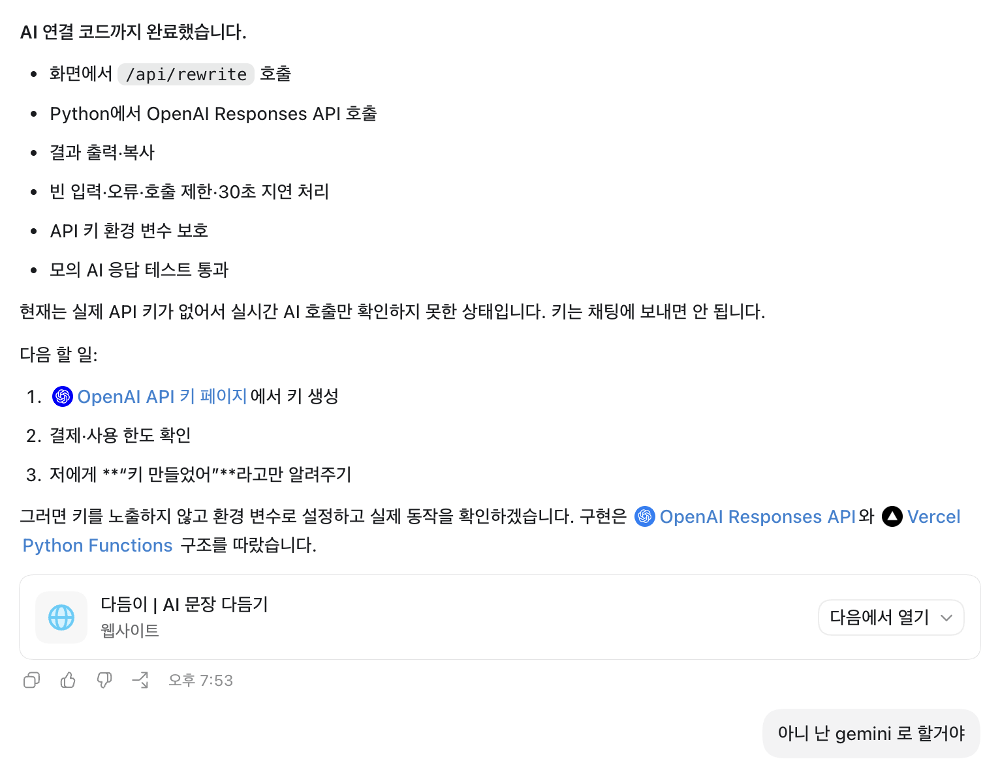

# 다듬이

상황과 말투에 맞게 사용자의 초안을 자연스러운 한국어 문장으로 다듬어 주는 AI 메시지 도우미입니다. 대학생, 취업 준비생, 사회 초년생처럼 이메일·부탁·사과·문의 문장을 작성할 때 표현을 고민하는 사용자를 위해 만들었습니다.

## 서비스 링크

- 배포 URL: [https://p2-3-beige.vercel.app/](https://p2-3-beige.vercel.app/)
- GitHub 저장소: [https://github.com/yak7297/p2-3](https://github.com/yak7297/p2-3)

## 핵심 기능

- 원문을 최대 1,000자까지 입력
- 이메일, 부탁, 사과, 문의 중 사용 상황 선택
- 정중하게, 친근하게, 간결하게 중 원하는 말투 선택
- Gemini가 원문의 의미를 유지한 문장 생성
- 생성 결과 복사
- 빈 입력, API 오류, 응답 지연에 대한 안내 메시지
- 홈, AI 작성기, 사용 방법, FAQ의 네 개 섹션과 메뉴 이동
- 모바일·태블릿·데스크톱 반응형 화면

## 화면

### 데스크톱 홈



### 모바일 홈


### AI 문장 다듬기 결과



### AI 코딩 도구 사용 과정



## 기술 스택

| 구분 | 사용 기술 | 역할 |
| --- | --- | --- |
| 프론트엔드 | HTML5 | 화면의 내용과 구조 |
| 스타일 | CSS3 | 레이아웃, 디자인, 반응형 처리 |
| 동작 | Vanilla JavaScript | 입력 검증, `fetch`, 결과 표시, 오류 처리 |
| 백엔드 | Python, Vercel Serverless Functions | 요청 검증 및 Gemini API 호출 |
| AI | Google Gemini API (`google-genai`) | 상황과 말투에 맞는 문장 생성 |
| 배포 | GitHub, Vercel | 코드 관리 및 웹 서비스 배포 |

## 프로젝트 구조

```text
.
├── index.html              # 메인 화면과 네 개 섹션
├── css/style.css           # 디자인과 반응형 스타일
├── js/app.js               # 폼 처리, fetch 요청, 결과 출력
├── api/rewrite.py          # Python Serverless API
├── docs/
│   ├── service-plan.md     # 서비스 기획서
│   ├── ai-coding-log.md    # AI 코딩 도구 사용 과정
│   ├── evidence-checklist.md
│   └── screenshots/        # 서비스 및 AI 코딩 과정 화면 증빙
├── requirements.txt        # Python 패키지
├── vercel.json             # 정적 화면과 Python API 배포 설정
├── .env.example            # 환경 변수 예시
├── dev.py                  # 로컬 통합 실행 도우미
└── run_local.sh            # VS Code 실행 스크립트
```

## 환경 변수 설정

프로젝트 루트의 `.env.example`을 참고해 `.env.local` 파일을 만들고 아래 값을 설정합니다.

```env
GEMINI_API_KEY=발급받은_Gemini_API_키
GEMINI_MODEL=gemini-3.1-flash-lite
```

| 변수명 | 필수 여부 | 설명 |
| --- | --- | --- |
| `GEMINI_API_KEY` | 필수 | Google AI Studio에서 발급한 Gemini API 키 |
| `GEMINI_MODEL` | 선택 | 호출할 Gemini 모델. 미설정 시 기본 모델 사용 |

실제 `.env.local`은 `.gitignore`에 포함되어 GitHub에 업로드되지 않습니다. API 키를 HTML이나 JavaScript에 넣으면 방문자에게 노출될 수 있으므로, Python 백엔드만 환경 변수에서 키를 읽습니다.

## 로컬 실행 방법

### VS Code에서 실행

1. 프로젝트 폴더를 VS Code로 엽니다.
2. `.env.local`에 `GEMINI_API_KEY`를 입력합니다.
3. `Command + Shift + B`를 누릅니다.
4. `다듬이 실행` 작업을 선택합니다.
5. 브라우저에서 `http://127.0.0.1:4173/`을 엽니다.

처음 실행할 때는 필요한 Python 패키지를 자동으로 설치합니다. 실행을 멈추려면 터미널에서 `Control + C`를 누릅니다.

### 터미널에서 실행

```bash
bash run_local.sh
```

## AI 요청 흐름

1. 사용자가 문장, 사용 상황, 말투를 선택합니다.
2. JavaScript가 입력을 확인하고 `fetch('/api/rewrite')`로 JSON 요청을 보냅니다.
3. `api/rewrite.py`가 환경 변수에서 API 키를 읽고 Gemini API를 호출합니다.
4. Python 함수가 생성 결과를 JSON으로 반환합니다.
5. JavaScript가 응답을 화면의 결과 영역에 표시합니다.

프론트엔드는 Gemini를 직접 호출하지 않으므로 브라우저에 API 키가 노출되지 않습니다.

## Vercel 배포 방법

1. 프로젝트를 GitHub 저장소에 푸시합니다.
2. Vercel에서 **Add New → Project**를 선택하고 GitHub 저장소를 가져옵니다.
3. Vercel 프로젝트의 **Settings → Environment Variables**에 `GEMINI_API_KEY`를 등록합니다.
4. 필요하면 `GEMINI_MODEL`도 등록합니다.
5. 배포한 뒤 홈, 메뉴 이동, 모바일 화면, AI 결과 생성을 확인합니다.
6. 발급된 Vercel 주소가 README의 **서비스 링크**와 일치하는지 확인합니다.

환경 변수를 추가하거나 코드를 수정한 경우 Vercel에서 재배포해야 변경 사항이 적용됩니다.

## 실패 처리

- 빈 입력: API 요청 전에 필수 입력 안내
- 1,000자 초과: 글자 수 제한 안내
- API 오류: 잠시 후 다시 시도하라는 메시지
- 30초 초과: 응답 지연 안내 및 요청 취소
- 중복 요청: 처리 중 실행 버튼 비활성화

## 제출 문서

- [서비스 기획서](docs/service-plan.md)
- [AI 코딩 도구 사용 과정](docs/ai-coding-log.md)
- [증빙 자료 체크리스트](docs/evidence-checklist.md)
